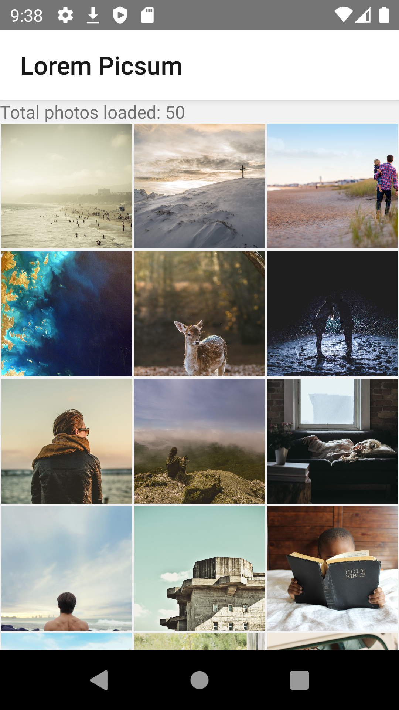
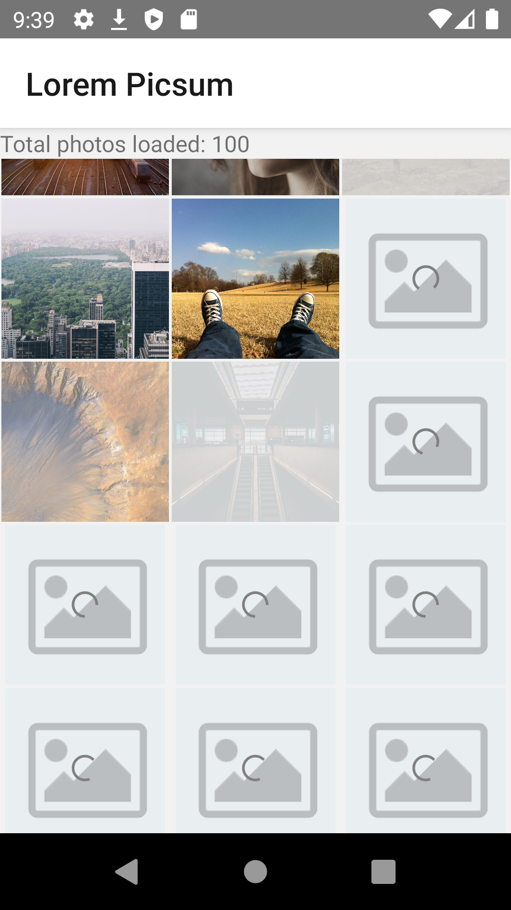
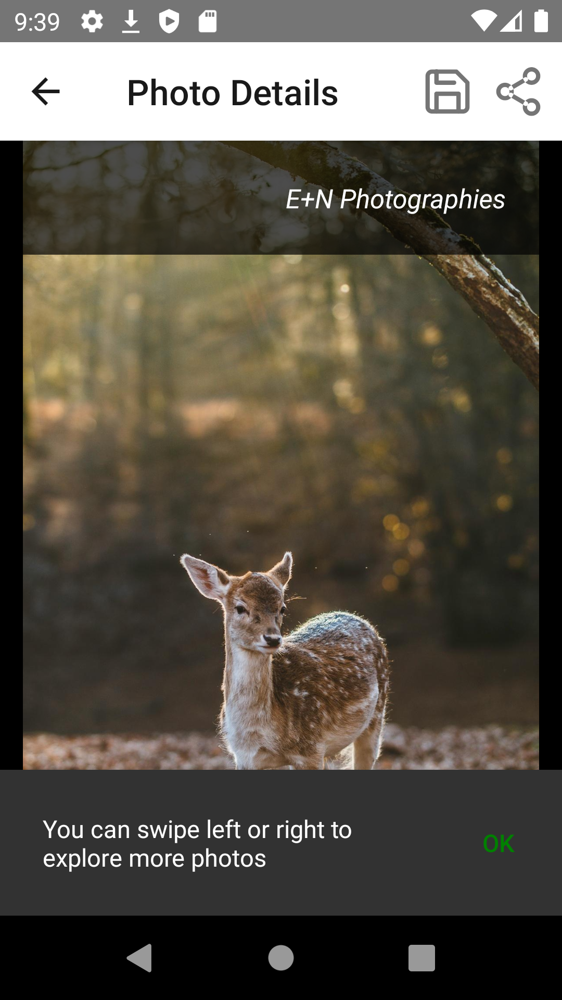
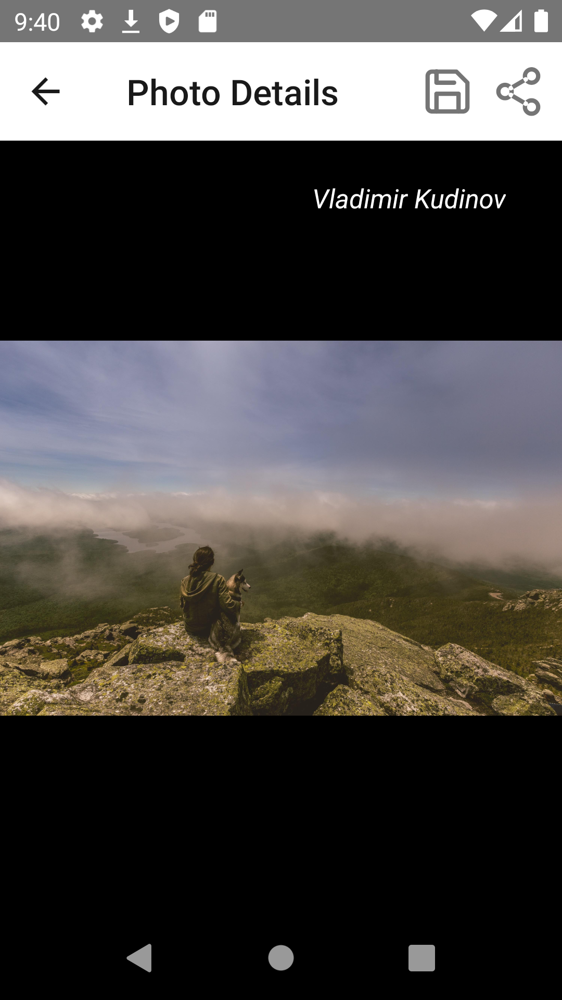
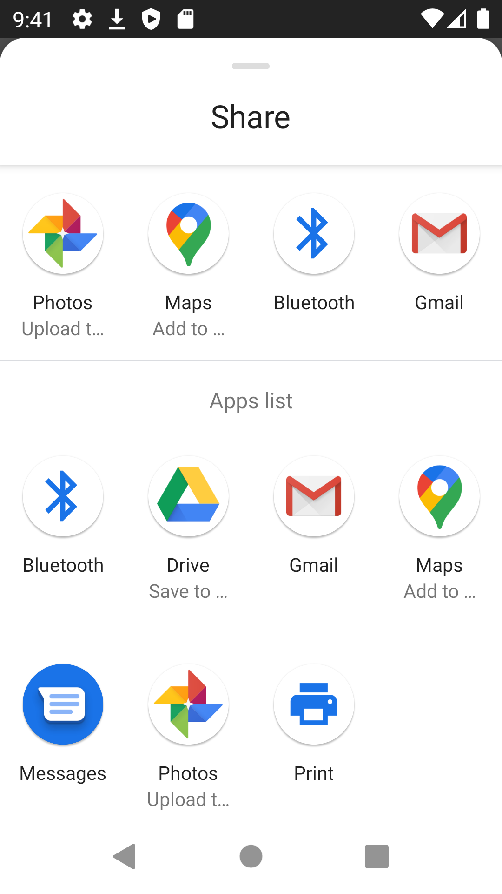
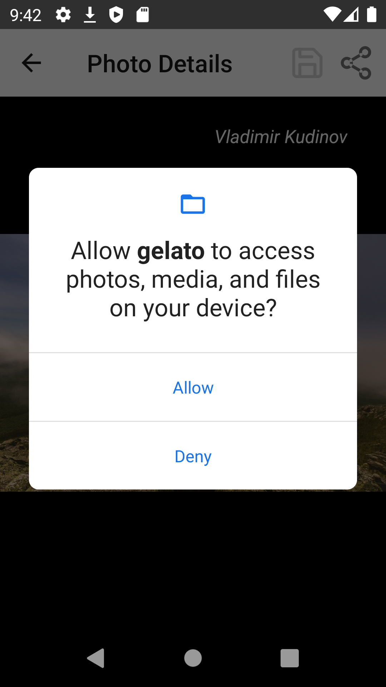
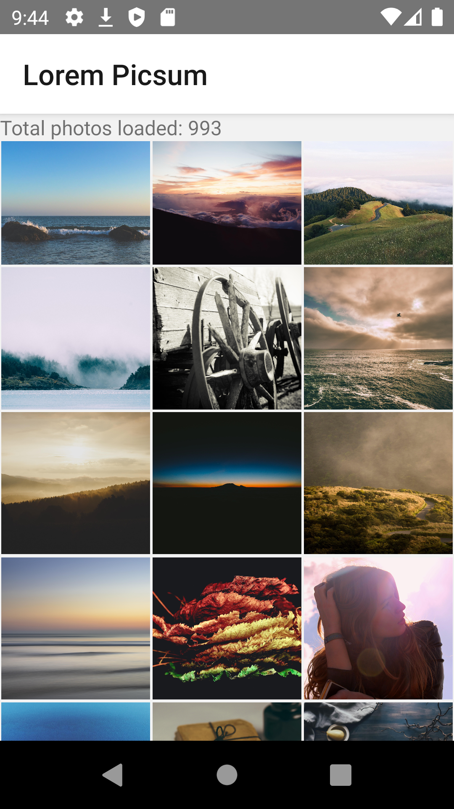

# Gelato

Not putting requirements out in public since this is a code assignment.

## Installation instructions

**Step 1:** git clone this repo:

**Step 2:** cd to the cloned repo:

**Step 3:** Install the Application with `yarn` or `npm i`

## :arrow_forward: How to Run App

1. cd to the repo
2. Run Build for either Android or iOS

- for Android
  - run `yarn android`
- for iOS

  - run `yarn ios`

- Other commands
  - For lint run `yarn lint`
  - For creating android release build run `yarn android:build:apk`

## Lint status

    3 warnings and 1 error.

## App overview

#### App video

#### Home Screen

#### Thumbnail loader

#### Photo details

#### Swipe gesture

#### Pinch to zoom

#### Share picture on social media

#### Permission dialog on saving picture

#### Infinite scroll

