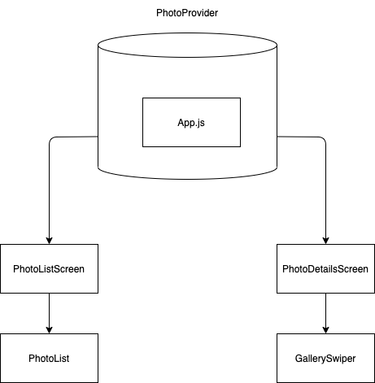

# Gelato gallery app design

## Current app design

## Design decisons

- Redux vs Context api and hooks
- Class component vs Functional components

### Redux vs Context api and hooks

### Class component vs Functional components

## Backend improvements

- Thumbnail support
- Provide valid PNG/JPEG files for caching

## Bugs in the existing system
